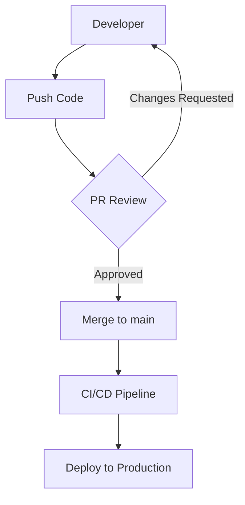
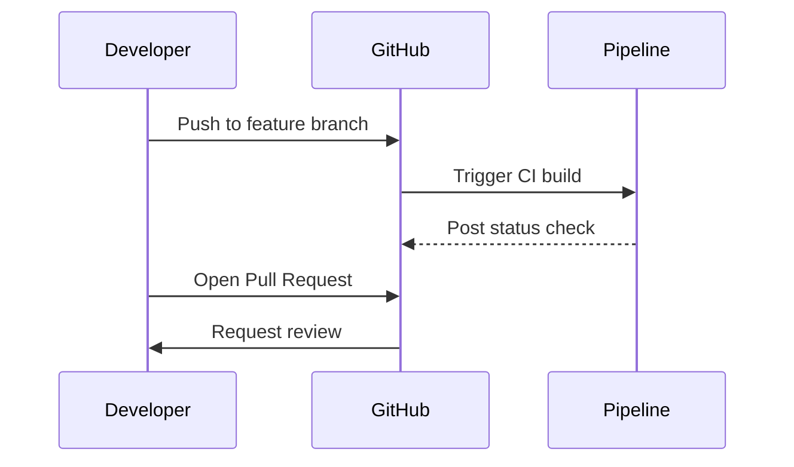

# Domain 1: Design and Implement Processes and Communications

**Exam Weight: 10–15%**

[← Back to Main](./README.md)

---

## 📑 Table of Contents

- [1.1 Design and Implement Traceability and Flow of Work](#11-design-and-implement-traceability-and-flow-of-work)
- [1.2 Design and Implement Appropriate Metrics and Queries](#12-design-and-implement-appropriate-metrics-and-queries)
- [1.3 Configure Collaboration and Communication](#13-configure-collaboration-and-communication)

---

## 1.1 Design and Implement Traceability and Flow of Work

### GitHub Flow

GitHub Flow is a **lightweight, branch-based workflow** designed for teams that deploy regularly.

```
main ──────────────────────────────────────────────►
        │                               ▲
        └── feature/my-feature ─────────┘
             (PR → review → merge)
```

**Steps:**
1. Create a **branch** from `main`
2. Add **commits** to the branch
3. Open a **Pull Request (PR)**
4. Review and **discuss** the code
5. **Deploy** from the branch for testing (optional)
6. **Merge** into `main`

> ⭐ **Key distinction:** GitHub Flow vs Git Flow:
> - **GitHub Flow**: One long-lived branch (`main`), deploy from feature branches. Simple, continuous delivery.
> - **Git Flow**: Multiple long-lived branches (`main`, `develop`, `release`, `hotfix`). Suited for versioned releases.

---

### Feedback Cycles

| Tool | Purpose |
|------|---------|
| **GitHub Issues** | Track bugs, features, and tasks tied to code |
| **GitHub Discussions** | Community Q&A, announcements, open conversations |
| **PR Comments / Reviews** | Inline code feedback with mandatory approval gates |
| **Azure Boards** | Agile planning: epics, stories, tasks, sprints |
| **GitHub Notifications** | Email/web alerts for mentions, reviews, CI results |

**Feedback cycle best practices:**
- Set up **required reviewers** on protected branches
- Use **CODEOWNERS** file to auto-assign reviewers by directory
- Enable **GitHub Actions** to post status checks on PRs
- Configure **notifications** so teams are alerted on failures without noise

---

### Integration for Tracking Work

#### Azure Boards

Azure Boards provides **Agile, Scrum, and CMMI** process templates.

| Work Item Type | Description |
|---------------|-------------|
| **Epic** | High-level goal spanning multiple sprints |
| **Feature** | Functionality within an epic |
| **User Story / PBI** | Deliverable unit of value |
| **Task** | Granular unit of work within a story |
| **Bug** | Defect tracked through the same pipeline |

**Linking commits & PRs to work items:**
```
# In commit message or PR title:
Fixes AB#1234
Resolves AB#5678
```

#### Azure Boards ↔ GitHub Integration

1. Install the **Azure Boards GitHub App** from GitHub Marketplace
2. Connect the Azure DevOps organization to the GitHub repository
3. Use keywords in commits: `AB#<ID>` to auto-link work items
4. Work item state transitions can be triggered by PR merges

#### GitHub Projects

- **Project boards** (Kanban-style): columns for To Do, In Progress, Done
- **Project (new)**: spreadsheet + board views with custom fields, grouping, filtering
- Automatically move cards based on PR/issue events using automation rules

---

### Source, Bug, and Quality Traceability

**Traceability chain:**

```
Requirement (Work Item) → Code (Branch/PR) → Build → Test Results → Deployment
```

| Traceability Type | How to Implement |
|------------------|-----------------|
| **Source traceability** | Link commits/PRs to work items (AB#ID) |
| **Bug traceability** | Create bugs from failed test runs; link to build |
| **Quality traceability** | Test results attached to pipelines; code coverage gates |

---

## 1.2 Design and Implement Appropriate Metrics and Queries

### Key DevOps Metrics (DORA Metrics)

The **DORA (DevOps Research and Assessment)** four key metrics:

| Metric | Definition | High Performer |
|--------|-----------|----------------|
| **Deployment Frequency** | How often code is deployed to production | Multiple times/day |
| **Lead Time for Changes** | Time from commit to running in production | < 1 hour |
| **Mean Time to Recovery (MTTR)** | Time to restore service after incident | < 1 hour |
| **Change Failure Rate** | % of deployments causing incidents | 0–15% |

### Flow Metrics (Cycle & Lead Time)

| Metric | Formula / Description |
|--------|----------------------|
| **Cycle Time** | Time from "work started" to "work done" |
| **Lead Time** | Time from "request created" to "delivered" |
| **Throughput** | Number of work items completed per period |
| **Work In Progress (WIP)** | Count of active items at any time |
| **Flow Efficiency** | Active time / total elapsed time |

> ⭐ **Exam tip:** Know the difference between **Lead Time** (entire value stream) and **Cycle Time** (active work only).

---

### Azure DevOps Analytics & Dashboards

**How to create a dashboard in Azure DevOps:**
1. Go to **Overview → Dashboards → New Dashboard**
2. Add widgets: Burndown, Velocity, Cumulative Flow Diagram (CFD), Lead Time, Cycle Time

**Key widgets:**
| Widget | Shows |
|--------|-------|
| **Velocity** | Work completed per sprint |
| **Burndown** | Work remaining vs time |
| **Cumulative Flow Diagram** | WIP and flow health |
| **Lead Time / Cycle Time** | Distribution of delivery times |
| **Test Results Trend** | Pass/fail rate over time |
| **Code Coverage** | % of code covered by tests |
| **Deployment Frequency** | Releases over time |

---

### Metrics by Domain

#### Project Planning Metrics
- **Sprint velocity** (story points delivered per sprint)
- **Epic/Feature completion** percentage
- **WIP limits** — set in Azure Boards columns

#### Development Metrics
- **Pull request turnaround time**
- **Code churn** (lines added/removed)
- **Number of active branches**

#### Testing Metrics
- **Test pass rate** (overall and by suite)
- **Flaky test rate** (tests with inconsistent results)
- **Code coverage percentage** (line/branch coverage)
- **Mean time to detect** (MTTD) bugs

#### Security Metrics
- **Open vulnerability count** (by severity: Critical, High, Medium, Low)
- **Mean time to remediate** security findings
- **Secrets scanning alert count**
- **Dependabot alert trends**

#### Delivery Metrics
- **Deployment frequency** per environment
- **Deployment success rate**
- **Rollback rate**

#### Operations Metrics
- **MTTR** (Mean Time to Recovery)
- **Service availability / uptime %**
- **Incident count by severity**
- **Change failure rate**

---

## 1.3 Configure Collaboration and Communication

### Wikis and Process Diagrams

#### Azure DevOps Wiki
- **Project Wiki**: Created per-project, stored in a Git repository
- **Code Wiki**: Publish any Git repo folder as a wiki
- Supports **Markdown**, tables, code blocks, images, attachments

**Markdown tips for wikis:**
```markdown
# Heading 1
## Heading 2

**Bold**, *italic*, `inline code`

| Col A | Col B |
|-------|-------|
| val1  | val2  |

[Link text](./other-page.md)
```

#### Mermaid Syntax in Wikis

Azure DevOps and GitHub both support **Mermaid diagrams** natively in Markdown:

````markdown

````



**Common diagram types:**
| Type | Syntax | Use Case |
|------|--------|----------|
| Flowchart | `graph TD` | Process flows |
| Sequence | `sequenceDiagram` | API/service interactions |
| Gantt | `gantt` | Project timelines |
| Class | `classDiagram` | System design |
| State | `stateDiagram-v2` | State machines |

---

### Release Documentation

#### Release Notes Automation

**Using GitHub Actions to auto-generate release notes:**
```yaml
- name: Create Release
  uses: actions/create-release@v1
  with:
    tag_name: ${{ github.ref }}
    release_name: Release ${{ github.ref }}
    generate_release_notes: true   # Auto-generates from PR titles & commits
```

**Azure DevOps Release Notes:**
- Use the **Release Notes** task in pipelines
- Query Azure Boards for work items associated with the build
- Use the `GitChanges` API to list commits in a release

#### API Documentation
- **Swagger/OpenAPI**: Generate docs from code annotations
- **Azure API Management (APIM)**: Auto-import OpenAPI specs, developer portal
- Tools: Swagger UI, Redoc, DocFX

---

### Automating Documentation from Git History

**Using `git log` for changelogs:**
```bash
# Conventional commits format
git log --pretty=format:"- %s (%h)" v1.0.0..HEAD

# Output example:
# - feat: add user authentication (abc1234)
# - fix: resolve null reference in order service (def5678)
```

**Conventional Commits standard:**
```
<type>[optional scope]: <description>

Types: feat, fix, docs, style, refactor, test, chore, perf, ci
```

Tools that automate changelog generation:
- `standard-version`
- `semantic-release`
- `git-cliff`
- GitHub's built-in release notes

---

### Webhooks

Webhooks allow **external services** to be notified when events occur in GitHub or Azure DevOps.

**GitHub Webhook events (common):**
| Event | Trigger |
|-------|---------|
| `push` | Code pushed to a branch |
| `pull_request` | PR opened, closed, merged, reviewed |
| `issues` | Issue created, closed, labelled |
| `workflow_run` | GitHub Actions workflow completed |
| `release` | Release published |

**Configuring a webhook in GitHub:**
1. Repo → **Settings → Webhooks → Add webhook**
2. Set **Payload URL** (your endpoint)
3. Set **Content type** to `application/json`
4. Choose events to trigger
5. Set a **Secret** (HMAC SHA-256 for signature verification)

**Azure DevOps Service Hooks:**
- Navigate to **Project Settings → Service Hooks**
- Supports: Slack, Teams, Webhooks, Jenkins, Trello, and more
- Trigger on: build completed, release created, PR updated, work item changed

---

### Azure Boards ↔ GitHub Integration

**Setup steps:**
1. In Azure DevOps: **Project Settings → GitHub Connections**
2. Authorize with GitHub OAuth or Personal Access Token
3. Select repos to connect

**Capabilities once connected:**
- Link GitHub commits/PRs to Azure Boards work items using `AB#<ID>`
- View GitHub PR status in Azure Boards
- Auto-transition work items when PR is merged

**Commit message linking examples:**
```
git commit -m "Fix login bug AB#342"
git commit -m "Closes AB#199, implements AB#204"
```

---

### GitHub / Azure DevOps ↔ Microsoft Teams Integration

#### GitHub + Teams
- Install **GitHub app** in Microsoft Teams
- Subscribe to events: PRs, issues, commits, releases, deployments
- Commands in Teams: `@github subscribe owner/repo`

#### Azure DevOps + Teams
- Install **Azure DevOps app** in Microsoft Teams
- Configure subscriptions from Teams channel
- Get notified for: build failures, PR approvals, work item changes, releases

**Teams notification setup (Azure DevOps):**
1. In Teams channel → **Connectors → Azure DevOps**
2. Or use **Project Settings → Service Hooks → Microsoft Teams**
3. Filter by event type, branch, pipeline, etc.

---

## 🧠 Key Exam Tips for Domain 1

| Scenario | Answer |
|----------|--------|
| Link a commit to an Azure Boards item | Use `AB#<ID>` in the commit message |
| Automatically visualize a process flow in a wiki | Use Mermaid syntax in Markdown |
| Track DORA metrics in Azure DevOps | Use the **DORA Metrics** widget or Analytics queries |
| Notify Teams when a pipeline fails | Use **Service Hooks** → Microsoft Teams connector |
| Auto-generate changelog from commits | Use **Conventional Commits** + `semantic-release` or GitHub release notes |
| Embed a Kanban board metric | Use the **Cumulative Flow Diagram** widget |

---

[← Back to Main](./README.md) | [Next: Source Control Strategy →](./02-source-control-strategy.md)
